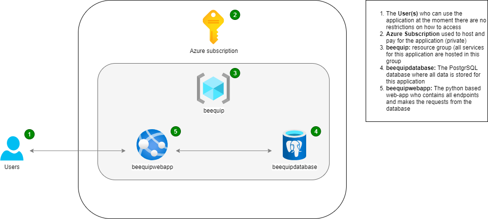
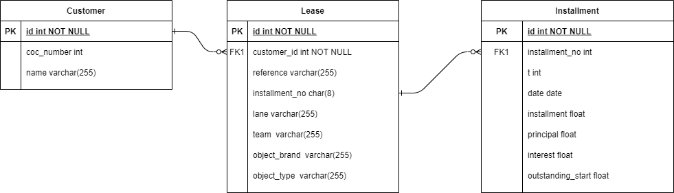
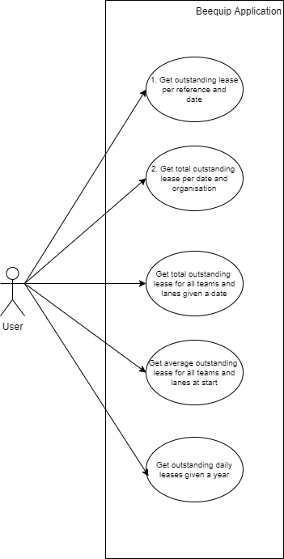

# Beequip_Test

For Beequip i will be making the data engineer test which is included for reference. All documentation about the application and datamodel is presented below. It also explains the progress i made to achieve the desired results in order of execution.

## Assessing Non-functional and functional requirements

The first step was to understand and translate all functional and non functional requirements and make key choises before i could start building the application and data model.

### Non-functional requirements

1. Application needs to be backed by a SQL server and explain your db server choice
   - I have chosen a PostgreSQL databases hosted on Microsoft Azure. I chose this type of server because i have heard it was already being used at Beequip. For this small test database PostgreSQL can handle all requirements. I chose to host this database on Azure because i already have a private account there.  
   - The design of the environement is documented
   
     
   

2. Use the data in the `data/` directory to create the database schema and records and explain how you did this
   - First inspect and design the database schema needed for this application
   
       
   
   - Create a database called beequip_test and assing a general_user to be a super user on this database. This user is used for all purposes needed in this project which is unsecure but only for this purpose.
   ```
   CREATE DATABASE beequip_test;
   CREATE ROLE general_user WITH LOGIN NOSUPERUSER INHERIT CREATEDB NOCREATEROLE NOREPLICATION PASSWORD 'xBP<`gR/2TV2BF)*';
   GRANT CONNECT ON DATABASE beequip_test TO general_user;
   GRANT ALL PRIVILEGES ON DATABASE beequip_test TO general_user;
   ```
   - To connect to this database all needed information in stored in the init.py file under database (unsecure). If you want to connect to your own database these values need to be adjusted accordingly. I specificly did not use environnement variables for this case only.
   - To fill all tables with the data in the .csv files i build the create.py file in create_database which is runnable in a python environnement. This reads all files and builds the needed tables according to the given shemas. All tables have their own hardcoded shema so that this is always consistent and well thought out. 
   
3. Respond to the API requests in JSON
   - TODO: By using Flask and JSON
4. No API authentication is required
   - I will implement a standard basic security to the database but include the authorization in the repository, so it will not be secure at all.

### Functional requirements

Of the 5 functional requirements i first created a use case diagram, just to get a visual overview of what is asked.

    

1. What's the outstanding for a lease given a reference and date?
   - The endpoint for the  url is:
     ```
     /api/v1/lease/<reference>/<year>/<month>/<day>
     ```
   - reference is the reference of the lease
   - year is the year of the outstanding lease
   - month is the month of the outstanding lease  
   - day is the day of the outstanding lease
   - The function checks the given input on validity, then fetches the first previous data row. It calculates the remaining Lease and returns this value under data and also corrects if the lease has ended and a negative balance remains. It also returns the input, status and mimetype for reference and validation. 
   - Example response:
     ```
     {
      "data": [
        {
            "outstanding": 13326.42
        }
      ],
      "day": "31",
      "mimetype": "application/json",
      "month": "12",
      "reference": "BQ2333.20132.01",
      "status": 200,
      "year": "2021"
      }
     ```
          
2. What's the total outstanding for a organisation given a Camber of Commerce number and date?
   - The endpoint for the  url is:
     ```
     /api/v1/organisation/<coc_number>/<year>/<month>/<day>
     ```
   - coc_number is the chamber of commerce number
   - year is the year of the outstanding lease
   - month is the month of the outstanding lease  
   - day is the day of the outstanding lease
   - The function checks the given input on validity, then fetches the first previous data rows for all leases associated with the customer. It calculates the remaining Lease and returns the sum of this value under data and also corrects if the lease has ended and a negative balance remains. It also returns the input, status and mimetype for reference and validation. 
   - Example response:
     ```
     {
      "coc_number": "68648456",
      "data": [
        [
            {
                "total_outstanding": 231633.66
            }
        ]
      ],
      "day": "31",
      "mimetype": "application/json",
      "month": "12",
      "status": 200,
      "year": "2019"
      }
     ```
     

3. What's the total outstanding per team and lane given a date?
- The endpoint for the  url is:
    ```
     /api/v1/team/current
    ```
   - It calculates the remaining Lease per team and lane and returns these values in a nested json. It has no sanity check wheter the calculated value is similar to the given value (for eq in the case of rouding issues)
   - Example response:
    
  ```
    {
        "data": {
            "teams": [
                [
                    {
                        "lanes": [
                            {
                                "lane": "beespecial",
                                "total_outstanding": 115406.3
                            }
                        ],
                        "team": "logistics",
                        "total_outstanding": 115406.29999999999
                    }
                ],
                [
                    {
                        "lanes": [
                            {
                                "lane": "beefast",
                                "total_outstanding": 73119.64
                            },
                            {
                                "lane": "beespecial",
                                "total_outstanding": 23907.79
                            }
                        ],
                        "team": "yellow",
                        "total_outstanding": 97027.43
                    }
                ]
            ]
        },
        "mimetype": "application/json",
        "status": 200
    }
  ```

4. What's the average outstanding at the start of the lease per team and lane?
- The endpoint for the  url is:
    ```
     /api/v1/team/start
    ```
   - It calculates the average Lease per team and lane at the start when no payments have been received and returns these values in a nested json.
   - Example response:
  ```
    {
        "data": {
            "teams": [
                [
                    {
                        "avg_outstanding": 57616.05,
                        "lanes": [
                            {
                                "avg_outstanding": 57616.05,
                                "lane": "beespecial"
                            }
                        ],
                        "team": "logistics"
                    }
                ],
                [
                    {
                        "avg_outstanding": 215243.5475,
                        "lanes": [
                            {
                                "avg_outstanding": 216084.095,
                                "lane": "beefast"
                            },
                            {
                                "avg_outstanding": 214403,
                                "lane": "beespecial"
                            }
                        ],
                        "team": "yellow"
                    }
                ]
            ]
        },
        "mimetype": "application/json",
        "status": 200
    }
  ```


5. What's the total daily outstanding given a year?
- The endpoint for the url is:
    ```
     /api/v1/daily/<year>
    ```
   - It returns the outstanding Lease per day for the entire year.
   - Example response:
  ```
    {
        "data": {
             "days": [
            [
                {
                    "day": "2021-01-01T00:00:00+00:00",
                    "sum": 344481.74000000005
                }
            ],
            [
                {
                    "day": "2021-01-02T00:00:00+00:00",
                    "sum": 343181.35000000003
                }
            ]
        },
        "mimetype": "application/json",
        "status": 200,
        "year": "2021"
    }
  ```   


>## Data engineer test
>
>We'll be using this test to assess your skill level as data engineer. This test is designed to covered a wide variety of skills that are needed in the day-to-day job of a data engineer at [Beequip](https://www.beequip.nl/). We expect you to spend a maximum of eight hours on this test. Don't worry when you run out of time though, we would still like to see what you came up with!
>
>### Objectives and requirements
>
>Create a Python web application that provides API endpoints to return the following information:
>
>- What's the outstanding for a lease given a reference and date?
>- What's the total outstanding for a organisation given a Camber of Commerce number and date?
>- What's the total outstanding per team and lane given a date?
>- What's the average outstanding at the start of the lease per team and lane?
>- What's the total daily outstanding given a year?
>
>Some of the requirements are:
>
>- Application needs to be backed by a SQL server and explain your db server choice
>- Use the data in the `data/` directory to create the database schema and records and explain how you did this
>- Respond to the API requests in JSON
>- No API authentication is required
>
>
>### Definitions
>
>In order to help you understand which data you need to use to provide the information you can use the definitions below.
>
>| Term | Definition |
>| --- | --- |
>| `t` | Loans are repaid in terms, this is the number of the term. |
>| `installment` | Amount that's paid in that month. |
>| `principal` | Amount that's repaid of the loan in that month. |
>| `interest` | Amount that's paid as interest on the loan in that month. | 
>| `outstanding` | Amount that's still remaining to be paid on a loan. |
>
>
>### Deliverables
>
>Send us a link to the hosted repository with your code. It can be hosted anywhere e.g. Github, Gitlab as long as you provide us access. Include all the code and instructions that are necessary to run the application and make the API requests.
>
>### Questions
>
>In case you have questions about the test you can contact Jan van der Pas (`jan.vanderpas@beequip.nl`).

